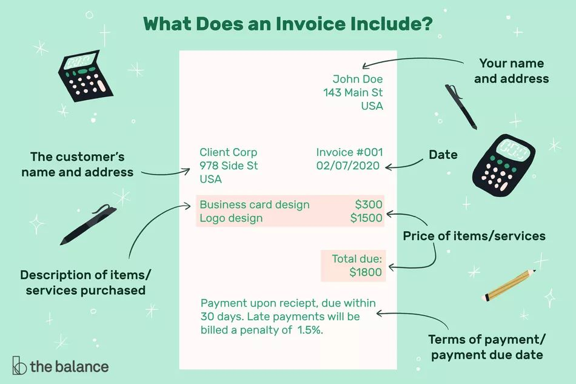
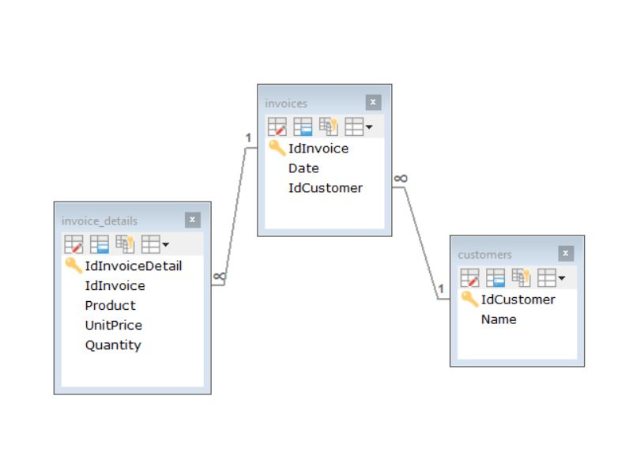

# Accessing a Mysql database using PHP and PdoOne

**PdoOne** is a library with two goals: performance and no dependency. This library consists of only 5 classes and a single interface.

https://github.com/EFTEC/PdoOne

This library also contains 3 different ways to work with the database.


## Example of an invoice.

For our exercise, we will use it to insert and read an invoice. This model contains 3 tables. 

- Invoices: it will store the header of the invoice, the number of invoice, the date, and its link to the customer
- Customer: it will have the customers, with the id of the customer and name.
- Invoice_details: it will have the details or list of products. Other values could be calculated.



## Creating our database of example

In MySQL, runs the next script.

```sql
CREATE SCHEMA `example-pdo` ;

CREATE TABLE `customers` (
 `IdCustomer` INT NOT NULL AUTO_INCREMENT,
 `Name` VARCHAR(45) NULL,
 PRIMARY KEY (`IdCustomer`));
 
CREATE TABLE `invoices` (
 `IdInvoice` INT NOT NULL,
 `Date` DATETIME NULL DEFAULT CURRENT_TIMESTAMP,
 `IdCustomer` INT NULL,
 PRIMARY KEY (`IdInvoice`),
 INDEX `invoices_fk1_idx` (`IdCustomer` ASC) VISIBLE,
 CONSTRAINT `invoices_fk1`
  FOREIGN KEY (`IdCustomer`)
  REFERENCES `customers` (`IdCustomer`)
  ON DELETE NO ACTION
  ON UPDATE NO ACTION);

CREATE TABLE `invoice_detail` (
 `IdInvoiceDetail` INT NOT NULL AUTO_INCREMENT,
 `Product` VARCHAR(45) NULL,
 `UnitPrice` DECIMAL(10,2) NULL,
 `Quantity` INT NULL,
 PRIMARY KEY (`IdInvoiceDetail`));

CREATE TABLE `invoice_details` (
 `IdInvoiceDetail` INT NOT NULL AUTO_INCREMENT,
 `IdInvoice` INT NULL,
 `Product` VARCHAR(45) NULL,
 `UnitPrice` DECIMAL(10,2) NULL,
 `Quantity` INT NULL,
 PRIMARY KEY (`IdInvoiceDetail`),
 INDEX `invoice_detail_fk1_idx` (`IdInvoice` ASC) VISIBLE,
 CONSTRAINT `invoice_detail_fk1`
  FOREIGN KEY (`IdInvoice`)
  REFERENCES `invoices` (`IdInvoice`)
  ON DELETE NO ACTION
  ON UPDATE NO ACTION);

```



## Connecting to the database

First, you must install the library, you can download or install it via composer (**composer require eftec/pdoone**)

// For the third method, this variable global must be called $pdoOne, or we need to inject the instance, or we need a function called pdoOne() that returns this instance.

```php
$pdoOne=new PdoOne('mysql','127.0.0.1','root','abc.123','example-pdo'); // type of database, server, user, password, schema name.
$pdoOne->open(); // we will open the connection
$pdoOne->logLevel=3; // it shows all errors with arguments (it is for debug purpose)
```


## Method 1: Using Raw Queries.

[example_simple.php](example_simple.php)

**PdoOne** allows us to runs raw queries that work directly to the database using the extension PDO. **It is the fastest way to execute our code**, so it is ideal if you want speed; after all, it works as a simple wrapper of PDO.

### Inserting

For example, inserting a customer.

```php
$statement=$pdoOne->runRawQuery('insert into customers(name) values (?)',['John Simple'],false);
$statement->closeCursor(); // it is a pdostatement
$statement=null; 
$idCustomer=$pdoOne->insert_id();
```

There are several ways to pass arguments to the method **runRawQuery()**. runRawQuery() could return a **PdoStatement** or an array. By default, it returns an array but it is possible to get a **PdoStatement** and use special functionalities of the extension PDO.

Another example of inserting (without a PdoStatement)

```php
$pdoOne->runRawQuery('insert into customers(name) values (?)',['John Simple'],true);
$idCustomer=$pdoOne->insert_id(); // we get the identity.
```

And another example (with named argument)

```php
$pdoOne->runRawQuery('insert into customers(name) values (:name)',['name'=>'John Simple'],true);
$idCustomer=$pdoOne->insert_id();
echo "added user $idCustomer";
```


### Listing

```php
$customers=$pdoOne->runRawQuery('select * from customers where name=?',['John Simple']);
var_dump($customers);
```

It returns an associative array with the values.

### Getting a single object

```php
$customers=$pdoOne->runRawQuery('select * from customers where idcustomer',[1]);
var_dump($customers); // [0=>['idcustomer'=>1,'name'=>'john']]
var_dump($customers[0]); // ['idcustomer'=>1,'name'=>'john']
```


### Inserting a full invoice

```php
// invoice header
$invoice=['IdInvoice'=>1,'Date'=> PdoOne::dateSqlNow(true), 'IdCustomer'=>1];
$pdoOne->runRawQuery('insert into invoices(idinvoice,date,idcustomer) values(:IdInvoice,:Date,:IdCustomer)',$invoice);
// Creating the detail of the invoice
$invoiceDetail=[1,'Cocacola',1000,3];
$query='insert into invoice_details(idinvoice,product,unitprice,quantity) values (?,?,?,?)';
$pdoOne->runRawQuery($query, $invoiceDetail);
$invoiceDetail=[1,'Fanta',2000,5];
$query='insert into invoice_details(idinvoice,product,unitprice,quantity) values (?,?,?,?)';
$pdoOne->runRawQuery($query, $invoiceDetail);
```


## Method 2: Using Method Chains

[example_method_chains.php](example_method_chains.php)

**PdoOne** also allows using of method chains (fluent). This way is also barebone, so the performance is close to raw queries. The chain of method works by one of more chain-methods, and you must always end with one end-of-the-chain method (such as insert,toList, first, update,etc.). Usually, you can chain any method in any order, but the end of the chain must be at the end of the chain. 

The execution of the code is always at the end of the chain.

### Inserting

There are many ways to write insert. It is one of them. 

```php
$idCustomer=$pdoOne
  ->from('customers')
  ->set(['name'=>'John Chain #1'])
  ->insert(); // $idcustomer gets the identity if any
```

also

```php
$idCustomer=$pdoOne->insert('customers',['name'=>'John Chain #2']); // $idcustomer gets the identity if any
```


### Listing

There are several method that we could use

```php
$customers=$pdoOne->select('*')
  ->from('customers')
  ->toList(); // end of the chain, it returns an associative array with the values.
```


### Getting a single object

It is also possible to get a single row. The library also allows to get a single value (useful for returns the count number)

```php
$customer=$pdoOne->select('*')
  ->from('customers')
  ->where('idcustomer=?',[1])
  ->first();
```

First returns the first query. If the query returns no value, then it returns false. If the query returns more than one row, then it returns only the first row.

### Inserting a full invoice

```php
// invoice header
$invoice=['IdInvoice'=>1,'Date'=> PdoOne::dateSqlNow(true), 'IdCustomer'=>1];
$pdoOne->set($invoice)->from('invoices')->insert();

// Creating the detail of the invoice
$invoiceDetail=['IdInvoice'=>1,'Product'=>'Cocacola','UnitPrice'=>1000,'Quantity'=>3];
$pdoOne->set($invoiceDetail)->from('invoice_details')->insert();

$invoiceDetail=['IdInvoice'=>1,'Product'=>'Fanta','UnitPrice'=>5000,'Quantity'=>5];
$pdoOne->set($invoiceDetail)->from('invoice_details')->insert();
```


## Method 3: Using a repository class

[example_use_generated.php](example_use_generated.php) (array)

[example_use_generated_object.php](example_use_generated_object.php) (objects)

This way requires an extra step. It requires to create a new set of classes. Those new classes are pre-calculated and obtained from the schema of the database. While it is fast, mainly because most values are pre-calculated once, but it still does more than the other methods.

### Creating the classes

[example_method_generate.php](example_method_generate.php)

In our exercise, we will use 3 tables: customers, invoice_details, and invoice.

For the table customers, we will need to generate 2 classes, **InvoiceDetailRepo** (our repository class) and optionally, our model class (**InvoiceDetail**)

- With arrays and objects:

```php
$errors=$pdoOne->generateAllClasses(
  [
​    'customers'=>['CustomerRepo','Customer'], // table => [repo class, model class]
​    'invoice_details'=>['InvoiceDetailRepo','InvoiceDetail'],
​    'invoices'=>['InvoiceRepo','Invoice']
  ]
  ,'BaseRepo' // it a common class
  ,['example\repo','example\model'] // namespaces of the repository class and model class.
  ,[__DIR__.'\repo',__DIR__.'\model']); // folders to where the repositories and model will be generated, they should exist.
```


- With only arrays:

```php
$errors=$pdoOne->generateAllClasses(
  [
​    'customers'=>'CustomerRepo', // table => repo class
​    'invoice_details'=>'InvoiceDetailRepo',
​    'invoices'=>'InvoiceRepo'
  ]
  ,'BaseRepo' // it a common class
  ,'example\repo' // namespaces of the repository class.
  ,__DIR__.'\repo'); // folders to where the repositories will be generated, they should exist.
```

If we run this class, it will generate the next files.

📁 model

 📃 AbstractCustomer.php // our model, this file is generated and it could be replaced.

 📃 Customer.php // our model (this file could be edited)

 ...

📁 repo

 📃 AbstractCustomerRepo.php // our repository class, this file mustn't be edited because it could be replaced

 📃 CustomerRepo.php // the repository class, this file could be edited

 📃 BaseRepo.php // Information common for all the tables.

 ...

### Inserting

First, we could create the object in two ways

If we want to use arrays, then we must set the next value

```php
BaseRepo::$useModel=false; // we will use array instead of objects
```

Creating an array,with BaseRepo::$useModel=false

```php
// using factory
$cus=CustomerRepo
  ::setRecursive('*')
  ::factory(['Name' => 'John Generated #1 (Array)']);
// using an array (the keys of the arrays must matches the columns of the table, including the case)
$cus=['Name' => 'John Generated #1 (Array)']; // correct
$cus=['name' => 'John Generated #1 (Array)']; // not correct (the column is called 'Name', not 'name')
```


Or creating an object,with BaseRepo::$useModel=true

```php
// using the constructor
$cus=new Customer(['Name' => 'John Generated #1 (Array)']);
// with empty constructor
$cus=new Customer();
$cus->Name='John Generated #1 (Array)';
```

And we could insert as follow

```php
$identity=CustomerRepo::insert($cus);
```

The method does the next operations.

- It inserts the value (or returns an exception or returns false)
- And it returns the identity (if any) in **$identity**. It will also modify **$cus** with the identity.

We don't need to specify the table or columns thanks that those values are stored in the class **AbstractCustomerRepo**

### Listing

This works similarly to the method chain with some differences.

- It doesn't require to specify the table or fields.
- This class works statically (::)
- It also allows a special concept: **recursive**
- It could return an associative array or an object.

```php
$r=CustomerRepo::where('IdCustomer',[1])::toList(); // select IdCustomer,Name from customers where IdCustomer=1
```


### Getting a single object

```php
$invoice=CustomerRepo::where('IdCustomer',[1])::first();
```


### Inserting a full invoice

Using array

```php
// header
$invoice=InvoiceRepo::setRecursive('*')::factory(['IdInvoice'=>1,'Date'=> PdoOne::dateSqlNow(true), 'IdCustomer'=>1]);
// InvoiceDetailRepo: IdInvoice islinked automatically, and IdInvoiceDetail is identity.
$invoice['_invoice_details']=[
    InvoiceDetailRepo::factory(['Product' => 'Cocacola','UnitPrice' => 1000,'Quantity' => 3]), 
    InvoiceDetailRepo::factory(['Product' => 'Fanta','UnitPrice' => 5000,'Quantity' => 2])
];

InvoiceRepo::setRecursive('_invoice_details')::insert($invoice);
```

Or using an object


```php
// header
$invoice=new Invoice();
$invoice->IdInvoice=1;
$invoice->Date=PdoOne::dateSqlNow(true);
$invoice->IdCustomer=1;

// InvoiceDetailRepo: IdInvoice islinked automatically, and IdInvoiceDetail is identity.
$invoice->_invoice_details=[
  new InvoiceDetail(['Product' => 'Cocacola','UnitPrice' => 1000,'Quantity' => 3]),
  new InvoiceDetail(['Product' => 'Fanta','UnitPrice' => 5000,'Quantity' => 2])
];
InvoiceRepo::setRecursive('_invoice_details')::insert($invoice);
```

**What the method setRecursive() does?**

If we run the next line

InvoiceRepo::insert($invoice);

Then, it will insert the values considering the first table (invoices)

insert into invoices(IdInvoice,Date,IdCustomer) values (..);

but we are not inserting the details of the invoice.

Instead

InvoiceRepo::setRecursive('*')::insert($invoice);

It will do the next inserts

```sql
insert into invoices(..) values (..);
insert into invoice_details(..) values (..);
insert into invoice_details(..) values (..);
insert into customer(..) values (..); -- however we don't want to insert the customer.
```

So, the correct recursivity should be

InvoiceRepo::setRecursive('_invoice_details')::insert($invoice);

When the class **repository** was generated, the library collected all the foreign keys. With the foreign keys, it could generate some relations. In this case, it generated the next relations:

- MANYTOONE invoice_details -> invoices
- **ONETOMANY invoices-> invoice_details** (using the field called **_invoice_details**)
- **MANYTOONE invoices-> customers** (using the field called **_customers**)
- ONETOMANY customers-> invoices

If we want to do a multiple-step operation, i.e. an operation that involves more than one table, then we must use **setRecursive**

- setRecursive(string: **TYPE OF RELATION**). 
- ql// examples:
- InvoiceRepo::setRecursive('MANYTOONE'); // it includes all the relations of the type MANYTOONE (i.e. _customers). 
- InvoiceRepo::setRecursive('*'); // it includes any relations but only relations of the table invoices (i.e. _invoice_details and _customers). 
- setRecursive(array: **COLUMNS**). 

It also allows to load recursive values inside another field using the character ("/")

```php
// examples:
// invoices->customers
InvoiceRepo::setRecursive(['_customers']); 
// invoice->customers and invoice->invoice_details
InvoiceRepo::setRecursive(['_customers','_invoice_details']); 
// invoice->customers , invoice->invoice_details and invoice_details->invoices
InvoiceRepo::setRecursive(['_customers','_invoice_details/_invoices']); 
```


## End Note.

- The first method works in the bare metal of the PDO extension, and it is the fastest method. However, it requires more work, and it could be cumbersome. This method is ideal when we need the speed or if we need to access functions of the Pdo.
- The second method is flexible, but the programmer requires to know the queries. This method is ideal for reporting and return values (such as list values in the front-end).
- The third method is more limited, but it is easy to work with it. It also requires to "compile" the tables and converts the table and the relations into a set of classes. This method is ideal for the back-end. Even when this method does many operations under the hood, but it gives the control to decide what it is doing (thanks to the function **setRecursive**).
- We shouldn't forget that the library **PdoOne** allows us to use all of them in the same project and at the same time:

// Using all of them.

```php
$invoices=InvoiceRepo::toList();  // select IdInvoice,Date,IdCustomer from invoices
$invoices=InvoiceRepo::base()->runRawQuery('select * from invoices'); // select * from invoices
$invoices=InvoiceRepo::base()->select('*')->from('invoices')->toList(); // select * from invoices
```

